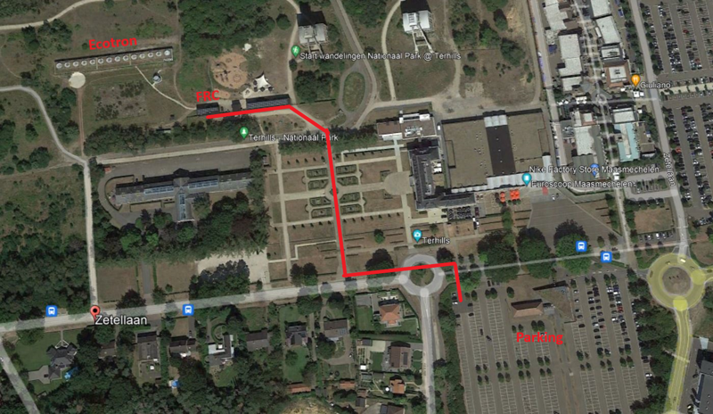

::: {.card .p-4 .border-0 .bg-primary .text-white}
### Get in Touch

Interested in collaborating or visiting the field station? 

We are always eager to connect with researchers, prospective students, and community partners.

[Email Us](mailto:frc@uhasselt.be){.btn .btn-frc .btn-lg .mt-3 role="button"}
:::

::: {.card .p-4 .border-0 .bg-secondary .my-4}
### Location

**📍 Physical Address**  
Field Research Centre - Hasselt University  
Zetellaan 52  
3630 Maasmechelen, Belgium  
  
[Open in Google Maps](https://maps.google.com/?q=51.001372,5.702596){.btn .btn-frc .btn-lg .mt-3 role="button"}
:::

## How to Get There

### 🚗 Car

Take **Exit 33** on the E314 highway (Brussels – Aachen). Follow the signs for **'Maasmechelen Leisure Valley'** along the route that runs alongside the canal for several kilometers.

Continue following the main road through **three roundabouts** until you see signage directing you toward **'PARKING EUROSCOOP'** and **'TERHILLS'**. Park your vehicle in this designated area.

From the parking lot, walk approximately **300 meters** through the historic **French Garden**. You will find the **Field Research Centre** located on your left side.

{.img-fluid .w-100 .shadow-sm alt="route description"}

---

### 🚌 Public transport

#### Train
If traveling by **train**, first take the train to **Genk** or **Hasselt** followed by a bus toward Maasmechelen.

#### Bus
Take the line X44 heading toward Maasmechelen. Disembark at the stop: **Maasmechelen Village** (the final stop on this line).

From the bus stop, follow the same walking route through the French Garden as shown in the map above!

