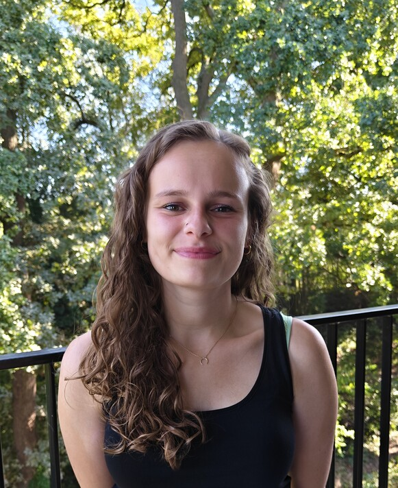
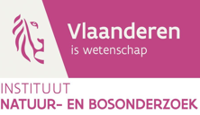

## Principal Investigator

::: {.grid} 

::: {.g-col-12 .g-col-md-4}
::: {.card .h-100 .text-center .shadow-sm .member-card}
::: {.card-body}

### Prof. Dr. Natalie Beenaerts {.h4 .mt-0}
**Professor - head of the Field Research Centre**  

<a href="people/NatalieBeenaerts.qmd" class="btn btn-outline-primary btn-sm mt-3">Learn more</a>
:::
:::
:::

::: 

## PhD researchers

::: {.grid} 

::: {.g-col-12 .g-col-md-4}
::: {.card .h-100 .text-center .shadow-sm .member-card}
::: {.card-body}

### Imke Tomsin {.h4 .mt-0}
**PhD researcher**  

[Research focus: mechanistic modelling to assess wildlife management strategies]{.small .text-muted}

<a href="people/ImkeTomsin.qmd" class="btn btn-outline-primary btn-sm mt-3">Learn more</a>
:::
:::
:::

::: {.g-col-12 .g-col-md-4}
::: {.card .h-100 .text-center .shadow-sm .member-card}
::: {.card-body}

### Wim Kuypers {.h4 .mt-0}
**PhD researcher**  

[Research focus: influence of human disturbance on spatiotemporal behaviour of wildlife]{.small .text-muted}

<a href="people/WimKuypers.qmd" class="btn btn-outline-primary btn-sm mt-3">Learn more</a>
:::
:::
:::

::: {.g-col-12 .g-col-md-4}
::: {.card .h-100 .text-center .shadow-sm .member-card}
::: {.card-body}

### Siebe Indestege {.h4 .mt-0}
**PhD researcher**  

[Research focus: biologger and camera trapping methodology to study spatiotemporal behaviour of wildlife]{.small .text-muted}

<a href="people/SiebeIndestege.qmd" class="btn btn-outline-primary btn-sm mt-3">Learn more</a>
:::
:::
:::

::: {.g-col-12 .g-col-md-4}
::: {.card .h-100 .text-center .shadow-sm .member-card}
::: {.card-body}

### Eliana Muccio {.h4 .mt-0}
**PhD researcher**  

[Research focus: human-wolf interactions]{.small .text-muted}

<a href="people/ElianaMuccio.qmd" class="btn btn-outline-primary btn-sm mt-3">Learn more</a>
:::
:::
:::

:::

## Associated Members 

::: {.grid} 

::: {.g-col-12 .g-col-md-4}
::: {.card .h-100 .text-center .shadow-sm .member-card}
::: {.card-body}

### Dr. ir. Jim Casaer {.h4 .mt-0}
**Senior researcher at INBO (Research Institute for Nature and Forest)**

<a href="people/JimCasaer.qmd" class="btn btn-outline-primary btn-sm mt-3">Learn more</a>
:::
:::
:::

::: {.g-col-12 .g-col-md-4}
::: {.card .h-100 .text-center .shadow-sm .member-card}
::: {.card-body}

### Dr. Mario Gordillo-Pérez {.h4 .mt-0}
**Researcher**

<a href="people/MarioGordilloPerez.qmd" class="btn btn-outline-primary btn-sm mt-3">Learn more</a>
:::
:::
:::

::: 

## Student researchers

::: {.grid} 

::: {.g-col-12 .g-col-md-4}
::: {.card .h-100 .text-center .shadow-sm .member-card}
::: {.card-body}

### Michaël Van Kets {.h4 .mt-0}
**MSc Biology**

[Project: Establishing an ecological baseline for future monitoring of the impact of large herbivore rewilding in National Park Bosland]{.small .text-muted}
:::
:::
:::

::: {.g-col-12 .g-col-md-4}
::: {.card .h-100 .text-center .shadow-sm .member-card}
::: {.card-body}

### Mattice Ballet {.h4 .mt-0}
**BSc Biology**  

[Project: Estimating population densities of roe deer (Capreolus capreolus), wild boar (Sus scrofa) and red fox (Vulpes vulpes) in National Park Hoge Kempen (NPHK)]{.small .text-muted}
:::
:::
:::

::: {.g-col-12 .g-col-md-4}
::: {.card .h-100 .text-center .shadow-sm .member-card}
::: {.card-body}

### Maxim Rousseau {.h4 .mt-0}
**BSc Biology** 

[Project: Habitat selection of wildlife in National Park Hoge Kempen using different methodologies]{.small .text-muted}
:::
:::
:::

:::

## Collaborating organisations 

::: {.grid} 

::: {.g-col-12 .g-col-md-4}
::: {.card .h-100 .text-center .shadow-sm .member-card}
::: {.card-body}

### INBO - Research Institute for Nature and Forest {.h4 .mt-0}

<a href="https://www.vlaanderen.be/inbo/home/" target="_blank" rel="noopener noreferrer" class="btn btn-outline-primary btn-sm mt-3">Visit website</a>
:::
:::
:::

::: 

## Past members 

### PhDs
* **Dr. Jolien Wevers**
* **Dr. Martijn Bollen**

### Master students 

2025-2026: Annelien Vantomme 

### Bachelor students

2025-2026: Lisa Bongaers, Robbe Van Assche, Giel Maesen