## Principal Investigator

::: {.grid} 

::: {.g-col-12 .g-col-md-4}
::: {.card .h-100 .text-center .shadow-sm .member-card}
::: {.card-body}
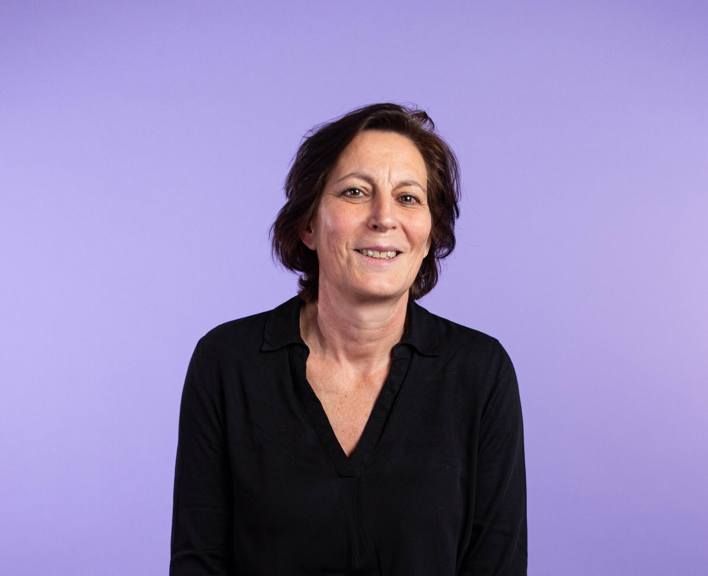

### Prof. Dr. Natalie Beenaerts {.h4 .mt-0}
**Professor - head of the Field Research Centre**  

<a href="people/NatalieBeenaerts.qmd" class="btn btn-outline-primary btn-sm mt-3">Learn more</a>
:::
:::
:::

::: 

## PhD researchers

::: {.grid} 

::: {.g-col-12 .g-col-md-4}
::: {.card .h-100 .text-center .shadow-sm .member-card}
::: {.card-body}
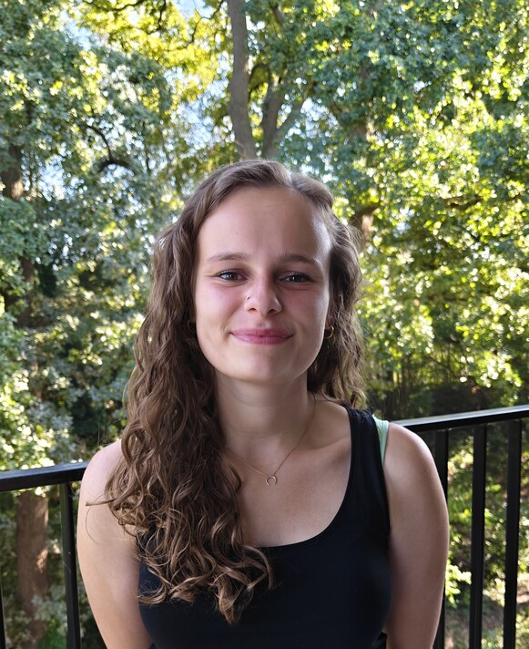

### Imke Tomsin {.h4 .mt-0}
**PhD researcher**  

[Research focus: mechanistic modelling to assess wildlife management strategies]{.small .text-muted}

<a href="people/ImkeTomsin.qmd" class="btn btn-outline-primary btn-sm mt-3">Learn more</a>
:::
:::
:::

::: {.g-col-12 .g-col-md-4}
::: {.card .h-100 .text-center .shadow-sm .member-card}
::: {.card-body}

### Wim Kuypers {.h4 .mt-0}
**PhD researcher**  

[Research focus: the influence of recreation on the spatiotemporal behaviour of wildlife]{.small .text-muted}

<a href="people/WimKuypers.qmd" class="btn btn-outline-primary btn-sm mt-3">Learn more</a>
:::
:::
:::

::: {.g-col-12 .g-col-md-4}
::: {.card .h-100 .text-center .shadow-sm .member-card}
::: {.card-body}
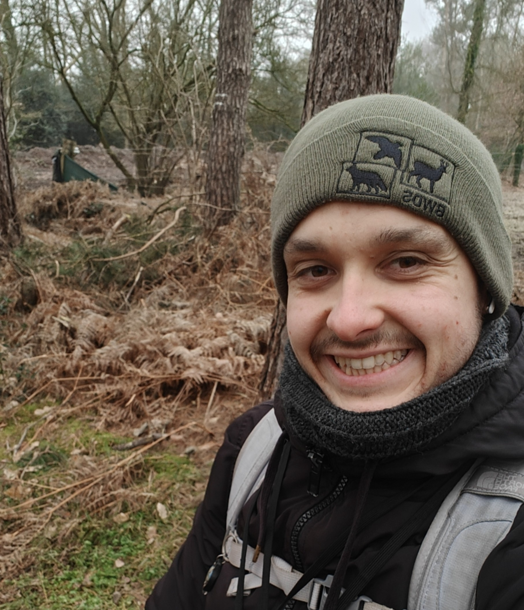

### Siebe Indestege {.h4 .mt-0}
**PhD researcher**  

[Research focus: long-term wildlife monitoring methodologies]{.small .text-muted}

<a href="people/SiebeIndestege.qmd" class="btn btn-outline-primary btn-sm mt-3">Learn more</a>
:::
:::
:::

::: {.g-col-12 .g-col-md-4}
::: {.card .h-100 .text-center .shadow-sm .member-card}
::: {.card-body}
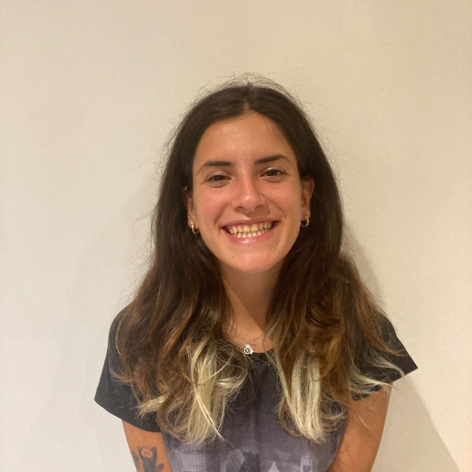

### Eliana Muccio {.h4 .mt-0}
**PhD researcher**

[Research focus: human-wildlife coexistence studies]{.small .text-muted}

<a href="people/ElianaMuccio.qmd" class="btn btn-outline-primary btn-sm mt-3">Learn more</a>
:::
:::
:::

:::

## Associated Members 

::: {.grid} 

::: {.g-col-12 .g-col-md-4}
::: {.card .h-100 .text-center .shadow-sm .member-card}
::: {.card-body}
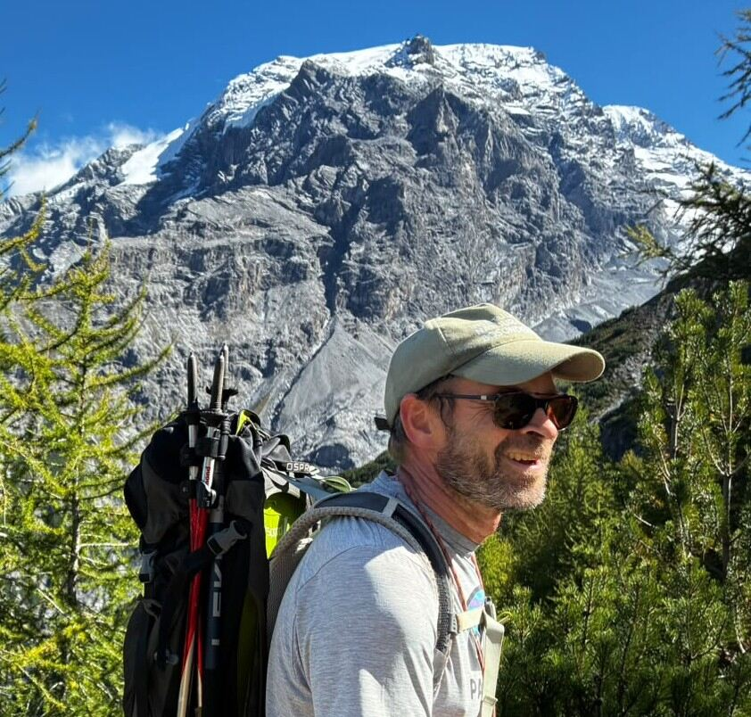

### Dr. ir. Jim Casaer {.h4 .mt-0}
**Senior researcher at INBO**

[Research focus: human-wildlife interactions, ungulates, wildlife management, structured decision-making, camera trapping]{.small .text-muted}

<a href="people/JimCasaer.qmd" class="btn btn-outline-primary btn-sm mt-3">Learn more</a>
:::
:::
:::

::: {.g-col-12 .g-col-md-4}
::: {.card .h-100 .text-center .shadow-sm .member-card}
::: {.card-body}

### Prof. Dr. Nicolas Dendoncker {.h4 .mt-0}
**Professor - UNamur**

<a href="people/NicolasDendoncker.qmd" class="btn btn-outline-primary btn-sm mt-3">Learn more</a>
:::
:::
:::

::: {.g-col-12 .g-col-md-4}
::: {.card .h-100 .text-center .shadow-sm .member-card}
::: {.card-body}
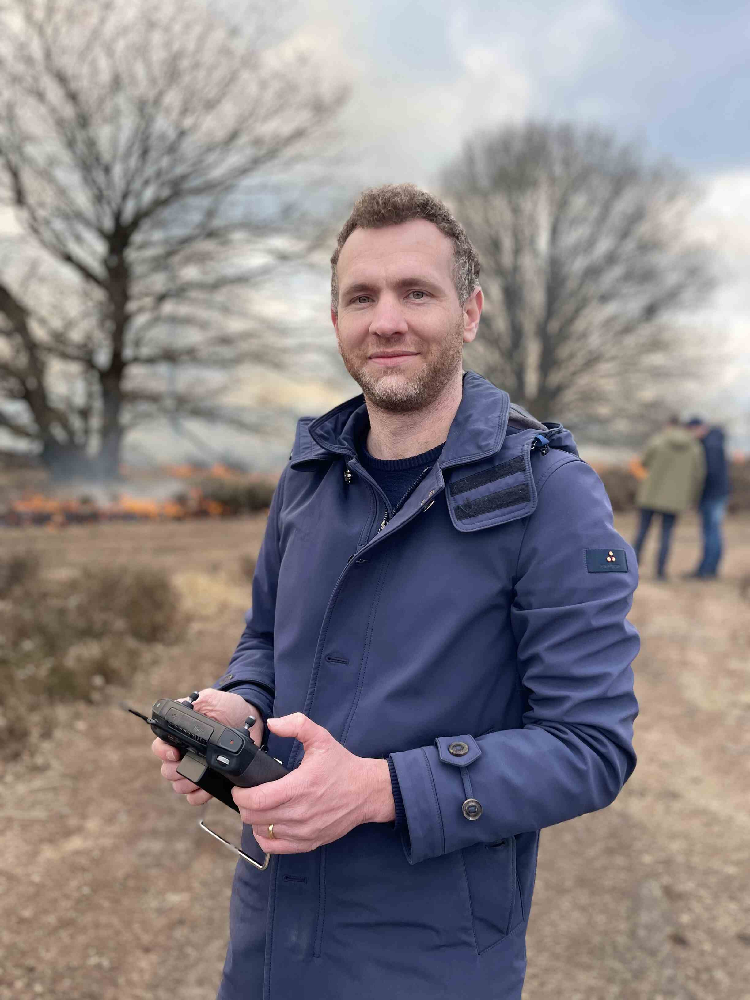

### Prof. Dr. Sam Ottoy {.h4 .mt-0}
**Guest professor**

[Research focus: urban ecosystems, wildfire, UAV]{.small .text-muted}

<a href="people/SamOttoy.qmd" class="btn btn-outline-primary btn-sm mt-3">Learn more</a>
:::
:::
:::

::: {.g-col-12 .g-col-md-4}
::: {.card .h-100 .text-center .shadow-sm .member-card}
::: {.card-body}
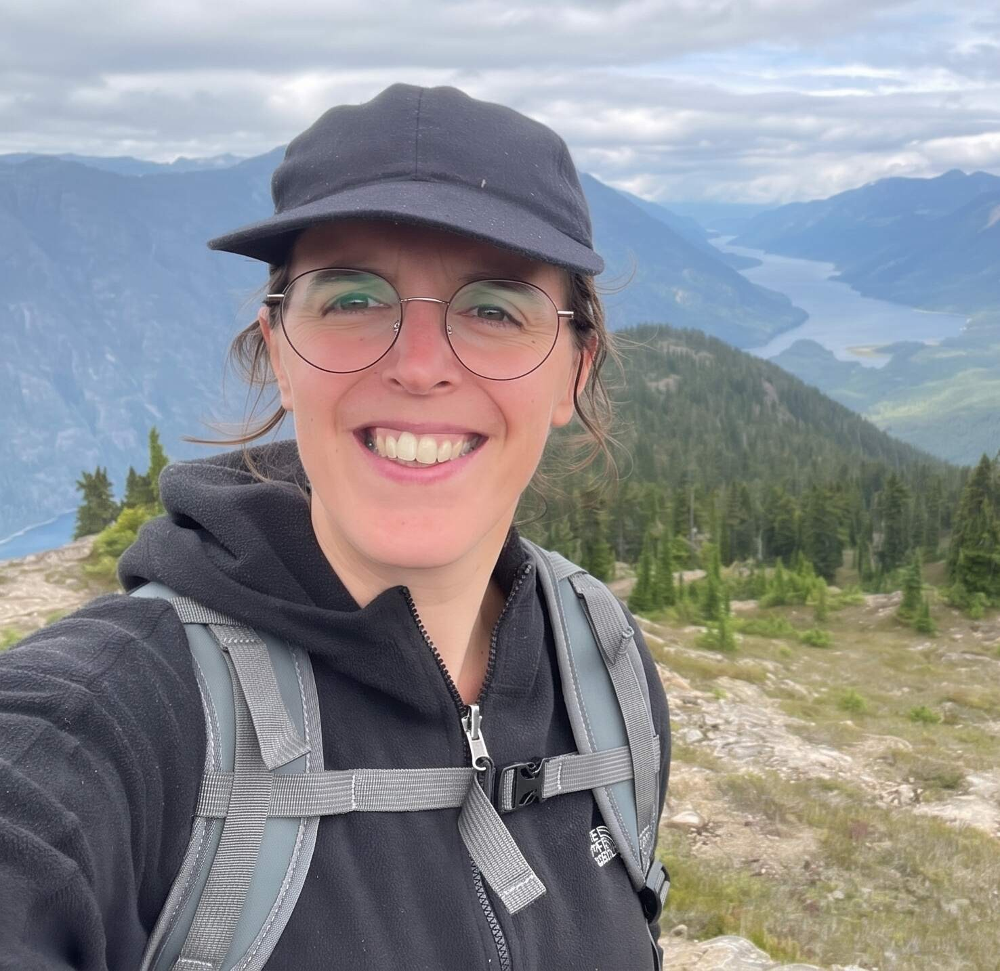

### Dr. Anneleen Rutten {.h4 .mt-0}
**Senior Researcher at INBO**

[Research focus: human-wildlife interactions]{.small .text-muted}

<a href="people/AnneleenRutten.qmd" class="btn btn-outline-primary btn-sm mt-3">Learn more</a>
:::
:::
:::

::: {.g-col-12 .g-col-md-4}
::: {.card .h-100 .text-center .shadow-sm .member-card}
::: {.card-body}
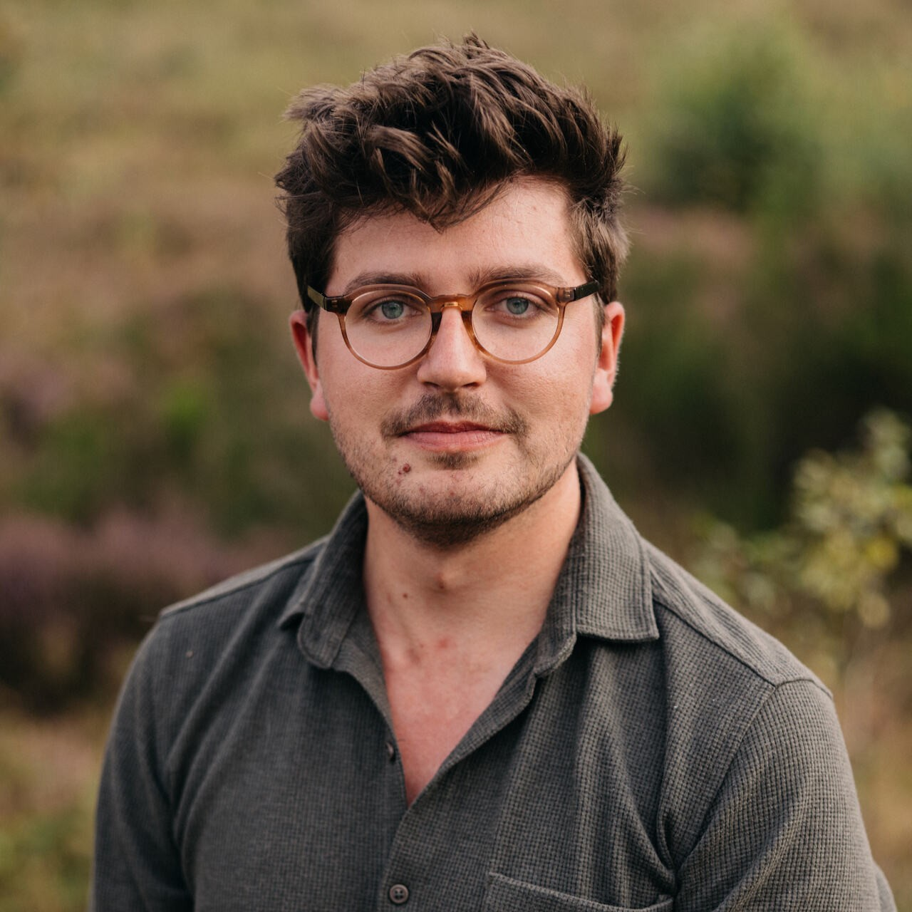

### Dr. Michiel Lathouwers {.h4 .mt-0}
**Researcher at INBO**

[Research focus: understanding avian ecology in human-modified landscapes ]{.small .text-muted}

<a href="people/MichielLathouwers.qmd" class="btn btn-outline-primary btn-sm mt-3">Learn more</a>
:::
:::
:::

::: {.g-col-12 .g-col-md-4}
::: {.card .h-100 .text-center .shadow-sm .member-card}
::: {.card-body}
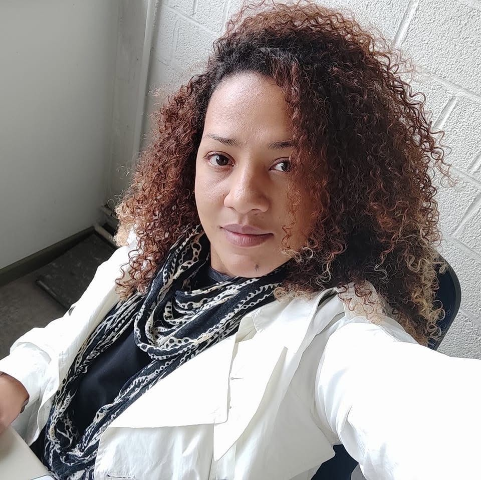

### Prof. Dr. Yanet Cruz Portorreal {.h4 .mt-0}
**Professor - Universidad de Oriente**

<a href="people/YanetCruzPortorreal.qmd" class="btn btn-outline-primary btn-sm mt-3">Learn more</a>
:::
:::
:::

::: {.g-col-12 .g-col-md-4}
::: {.card .h-100 .text-center .shadow-sm .member-card}
::: {.card-body}
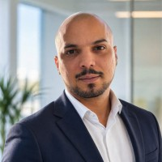

### Dr. Mario Gordillo-Pérez {.h4 .mt-0}
**Researcher**

[Research focus: thermal biology & functional ecology]{.small .text-muted}

<a href="people/MarioGordilloPerez.qmd" class="btn btn-outline-primary btn-sm mt-3">Learn more</a>
:::
:::
:::

::: {.g-col-12 .g-col-md-4}
::: {.card .h-100 .text-center .shadow-sm .member-card}
::: {.card-body}
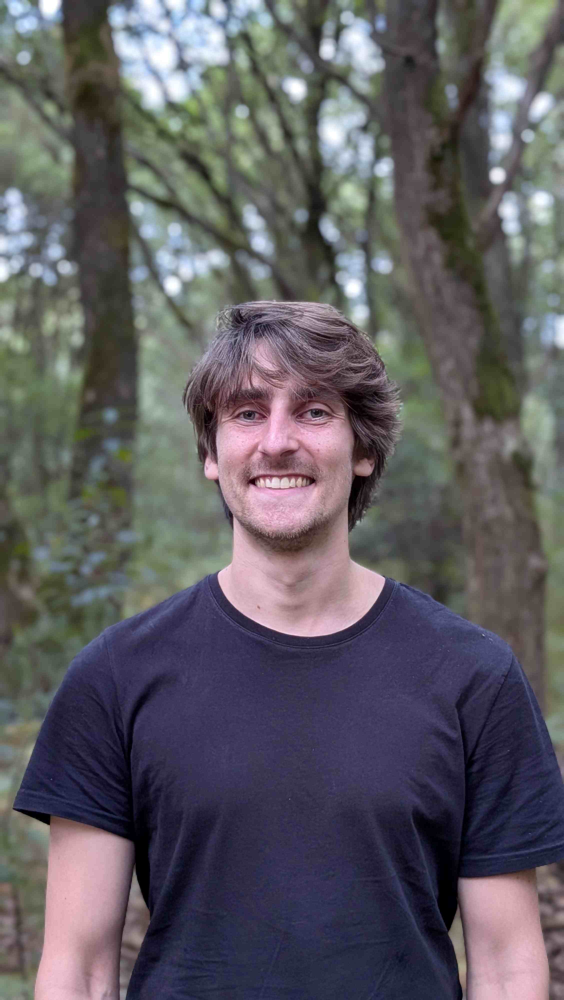

### Robbe Van Wassenhove {.h4 .mt-0}
**Researcher**

[Research focus: long-term ecological monitoring of bats and other small mammals]{.small .text-muted}

<a href="people/RobbeVanWassenhove.qmd" class="btn btn-outline-primary btn-sm mt-3">Learn more</a>
:::
:::
:::

::: 

## Student researchers

::: {.grid} 

::: {.g-col-12 .g-col-md-4}
::: {.card .h-100 .text-center .shadow-sm .member-card}
::: {.card-body}
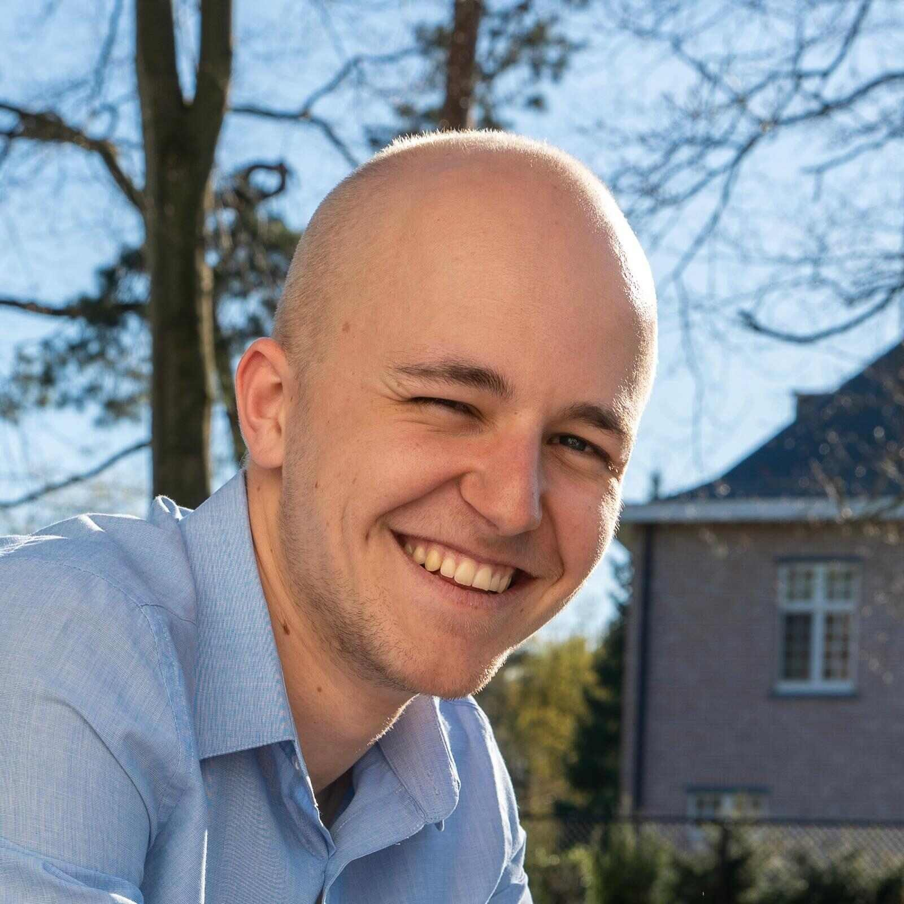

### Michaël Van Kets {.h4 .mt-0}
**MSc Biology**

[Project: Establishing an ecological baseline for future monitoring of the impact of large herbivore rewilding in National Park Bosland]{.small .text-muted}
:::
:::
:::

::: {.g-col-12 .g-col-md-4}
::: {.card .h-100 .text-center .shadow-sm .member-card}
::: {.card-body}
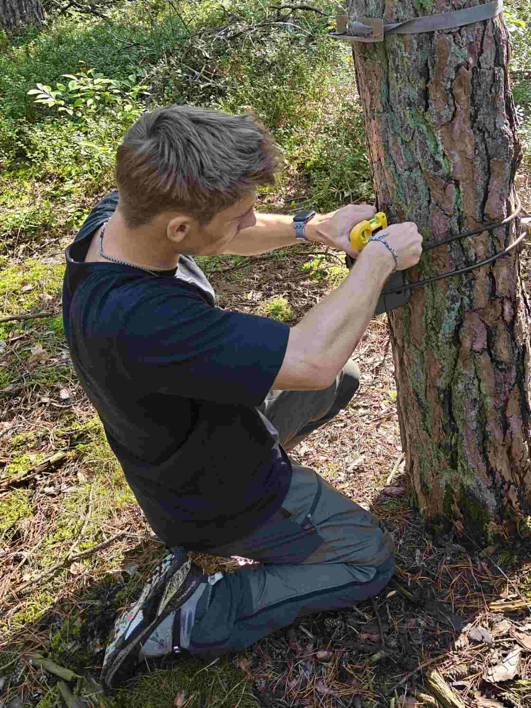

### Mattice Ballet {.h4 .mt-0}
**BSc Biology**  

[Project: Estimating population densities of roe deer (Capreolus capreolus), wild boar (Sus scrofa) and red fox (Vulpes vulpes) in National Park Hoge Kempen (NPHK)]{.small .text-muted}
:::
:::
:::

::: {.g-col-12 .g-col-md-4}
::: {.card .h-100 .text-center .shadow-sm .member-card}
::: {.card-body}
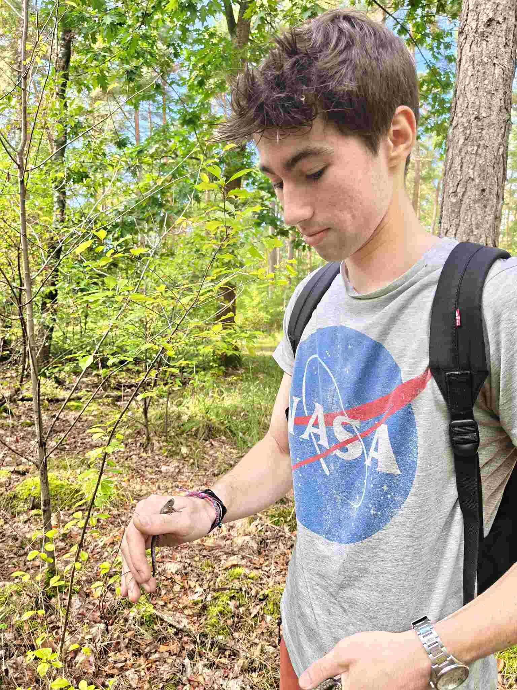

### Maxim Rousseau {.h4 .mt-0}
**BSc Biology** 

[Project: Habitat selection of wildlife in National Park Hoge Kempen using different methodologies]{.small .text-muted}
:::
:::
:::

::: {.g-col-12 .g-col-md-4}
::: {.card .h-100 .text-center .shadow-sm .member-card}
::: {.card-body}

### Stan Van Gils {.h4 .mt-0}
**BSc Biology** 

[Project: Evaluating the use of passive acoustic monitoring for assessing bird communities in fruit production orchards]{.small .text-muted}
:::
:::
:::

:::

## Collaborating organisations 

::: {.grid} 

::: {.g-col-12 .g-col-md-4}
::: {.card .h-100 .text-center .shadow-sm .member-card}
::: {.card-body}
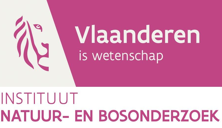

### INBO - Research Institute for Nature and Forest {.h4 .mt-0}

<a href="https://www.vlaanderen.be/inbo/home/" target="_blank" rel="noopener noreferrer" class="btn btn-outline-primary btn-sm mt-3">Visit website</a>
:::
:::
:::

::: {.g-col-12 .g-col-md-4}
::: {.card .h-100 .text-center .shadow-sm .member-card}
::: {.card-body}
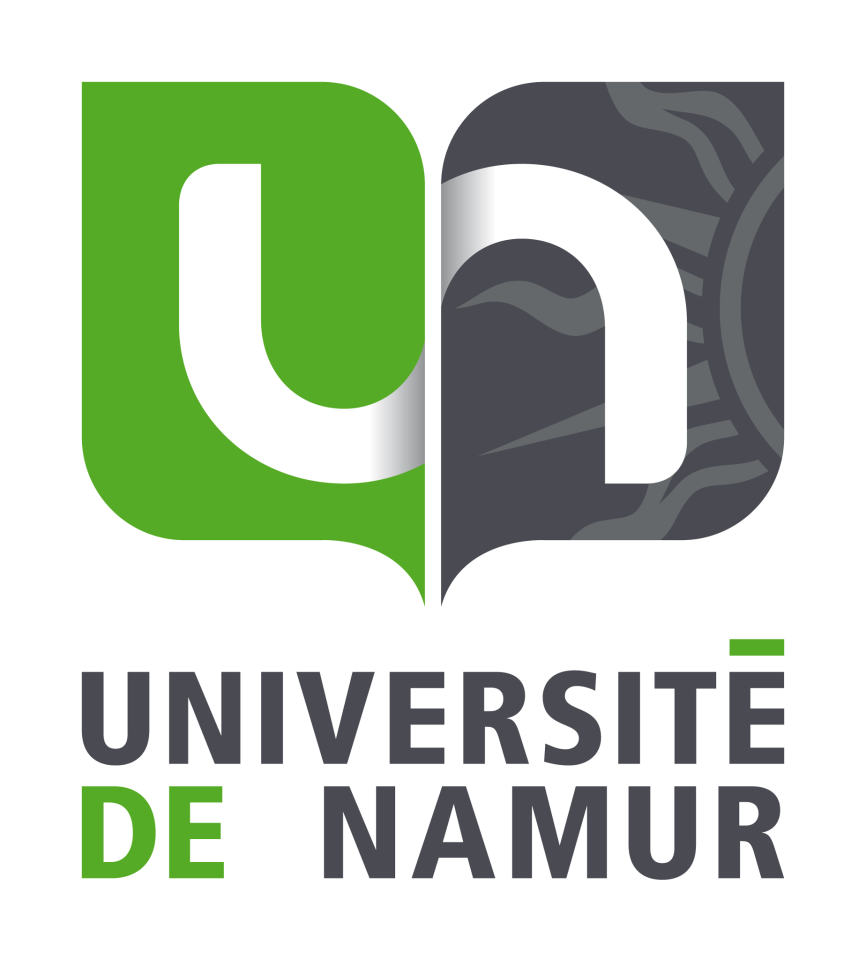

### Université de Namur {.h4 .mt-0}

<a href="https://www.unamur.be/en" target="_blank" rel="noopener noreferrer" class="btn btn-outline-primary btn-sm mt-3">Visit website</a>
:::
:::
:::

::: 

## Past members 

### PhD graduates
* **Dr. Jolien Wevers**
* **Dr. Martijn Bollen**

### Master & Bachelor thesis students (UHasselt) 

**2025-2026**: Annelien Vantomme, Lisa Bongaers, Robbe Van Assche, Giel Maesen  
**2024-2025**: Noah May, Stan Moors, Ward Wuestenberghs, Kim Verhemeldonck, Luna Vlayen, Robbe Van Wassenhove, Arne Beck, Freya Strackx, Roos Corbeels  
**2023-2024**: Katrijn De Ryck, Marie Nijs, Nena Vossen  
**2022-2023**: Birk Auwerkerken, De Greef Robine, Nynke De Vries, Willard Loots, Frank van Montfort, Fien Vandenberghe  
**2021-2022**: Jo Vandersanden, Gianni De Coster  
**2020-2021**: Siebe Indestege, Janne Bekaert, Jasper Roussard, Emmanuel Van Biesbrouck, Ebe Verheyen   
**2019-2020**: Wim Kuypers, Stoffel Wirges, Tibo Simons, Michaël van Kets  
**2018-2019**: Sam Bielen, Lorens Christiaens, Laura Evenepoel, Jessie Machiels, Laurens Le Jeune, Sven Baerten  
**2017-2018**: Stefanie Kelchtermans, Yens Vandenboer, Sam Vastmans, Brecht Massoels, Eva Vanstraelen, Thibeau Bottu, Alexander Aerts, Eva Andries, Gust Boiten, Roel Lammerant, Ann-Kathrin Coenen, Iris D'Huys  
**2016-2017**: Ellen Truyers, Pieter Scholberg, Lisa Partoens  
**2015-2016**: Michiel Hamelinck  
**2014-2015**: Tina Coenegracht, Kris Somers  
**2013-2014**: Jolien Wevers, Gilles Busé, Lucas Robin  

### External (co-)supervised master theses

**2023-2024**: Imke Tomsin (University of Antwerp)  
**2022-2023**: Siebe Indestege (KU Leuven)  
**2020-2021**: Ward Hamaekers (Inland Norway University of Applied Sciences), Sam Bielen (University of Antwerp)  
**2019-2020**: Jo DeRyck (KU Leuven)  
**2018-2019**: Mathieu Olbrechts (KU Leuven)  

### Internships
**2024-2025**: Rowin Lamers, Joël Bal (HAS Hogeschool, Netherlands)  
**2022-2023**: Max Langeveld (HAS Hogeschool, Netherlands)  
**2020-2021**: Kato Switten (Hogeschool PXL)  
**2019-2020**: Anne Habets (Hogeschool PXL), Amelia Lieva  
**2018-2019**: Joshua Seelen (HAS Hogeschool, Netherlands), Jonathan Withofs (Hogeschool PXL)  
**2015-2016**: Vera Pfannenstiller (Université de Montpellier, France)  