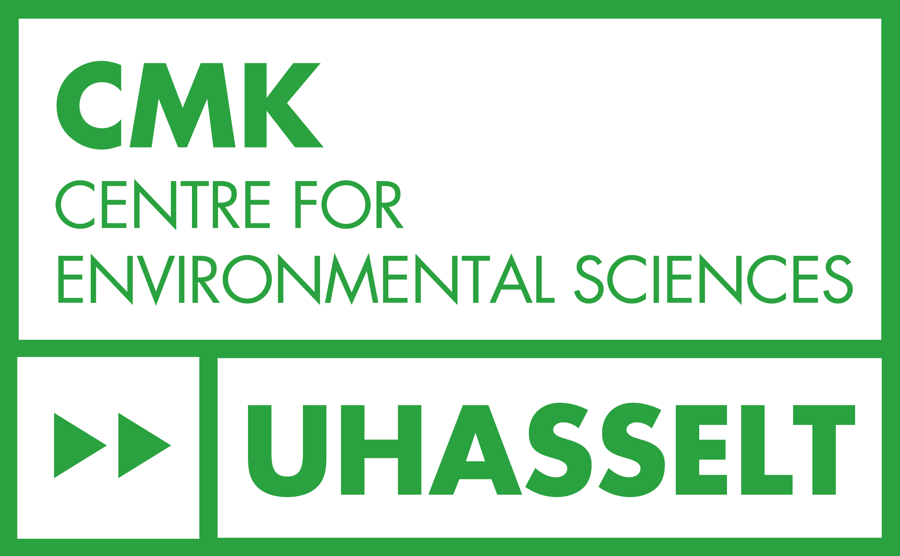
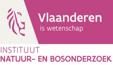

## About Me

---

## Research Interests

* 

---

## Publications

* 

## Other Outreach 

### Articles 

* 

### Conference presentations

* 

### Info days 
* 
---

## Collaborators & Partners

::: {.grid .align-items-center .g-4 .my-3}

::: {.g-col-6 .g-col-md-3 .text-center}
[{.collaborator-logo alt="CMK"}](https://www.uhasselt.be)
:::

::: {.g-col-6 .g-col-md-3 .text-center}
[{.collaborator-logo alt="INBO"}](https://www.vlaanderen.be/inbo)
:::

:::

* **Hasselt University**: host institution - Centre for Environmental Science, supervisor: Prof. Dr. Natalie Beenaerts
* **INBO** (Research Institute for Nature and Forest): partner institution, co-supervisor: Dr. Anneleen Rutten
