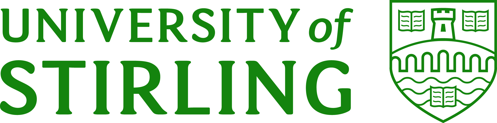
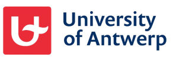

## About Me

My research focuses on the development and application of mechanistic models to support decision-making in wildlife management and conservation. I am particularly interested in human-wildlife interactions within social-ecological systems, with a focus on mammals including roe deer, wild boar, and wolves, and previously the European hamster.

---

## Research Interests

* **Individual-/agent-based modelling**
* **(Generalised) Management Strategy Evaluation ((G)MSE)**
* **Human-wildlife interactions & social-ecological systems**
* **Wildlife management & conservation**
* **Good Modelling Practices & open science**
* **Mammals**

---

## Publications

* Tomsin, I., Duthie, A. B., Bunnefeld, N., Leirs, H., Casaer, J., & Beenaerts, N. (2025). Evaluating Management Scenarios for the European Hamster (Cricetus cricetus) Using Quantitative Models. Ecology and Evolution, 15(10), e72353. <https://doi.org/10.1002/ece3.72353>

## Other Outreach 

### Articles 

* Tomsin, I., Duthie, A. B., Bunnefeld, N., Leirs, H., Casaer, J., & Natalie, B. (2025). Virtuele hamsters: Wat simulaties ons vertellen over de toekomst van de Europese hamster in Vlaanderen. NatuurFocus, 24(3), 112-120.

### Conference presentations

* International Wildlife Congress 2025
* Benelux Congress of Zoology 2024

### Infodays 
* Wetenschap in en rond het Nationaal Park Hoge Kempen 2025
* INBO PhD-dag 2025
---

## Collaborators & Partners

::: {.grid .align-items-center .g-4 .my-3}

::: {.g-col-6 .g-col-md-3 .text-center}
[{.collaborator-logo alt="FWO"}](https://www.fwo.be)
:::

::: {.g-col-6 .g-col-md-3 .text-center}
[{.collaborator-logo alt="CMK"}](https://www.uhasselt.be)
:::

::: {.g-col-6 .g-col-md-3 .text-center}
[{.collaborator-logo alt="INBO"}](https://www.vlaanderen.be/inbo)
:::

::: {.g-col-6 .g-col-md-3 .text-center}
[{.collaborator-logo alt="University of Stirling"}](https://www.stir.ac.uk/)
:::

::: {.g-col-6 .g-col-md-3 .text-center}
[{.collaborator-logo alt="University of Antwerp"}](https://www.uantwerpen.be)
:::

:::

* **Hasselt University**: host institution - Centre for Environmental Science, supervisor: Prof. Dr. Natalie Beenaerts
* **INBO** (Research Institute for Nature and Forest): co-host institution, co-supervisor: Dr. ir. Jim Casaer
* **FWO**: Funding Source - PhD Fellowship Fundamental Research 
* **University of Stirling**: partner institution, co-supervisors: Prof. Dr. Nils Bunnefeld & Dr. Brad Duthie
* **University of Antwerp**: partner institution, co-supervisor: Prof. Dr. Herwig Leirs
