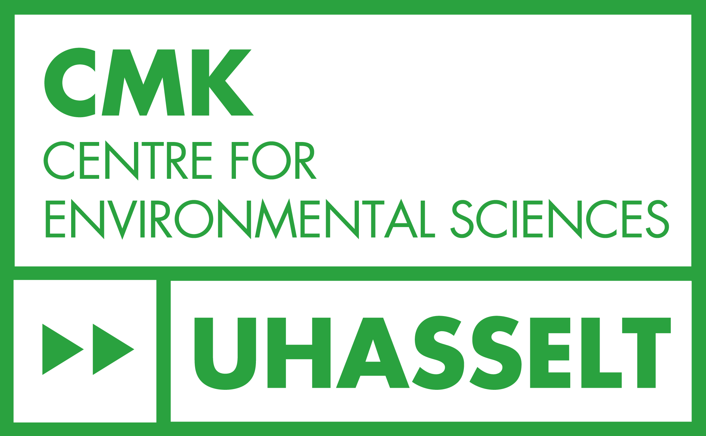

## About Me

I am a PhD researcher in environmental sciences focusing on human-wildlife interactions in highly visited protected areas. My research explores how different forms of human recreation influence spatiotemporal behaviour of wildlife, combining large-scale camera trap data with statistical modelling and human-tracking data sources such as social media-derived recreation data. Outside of my research, I am happiest when I can spend time outdoors and with friends. I enjoy hiking, camping, fishing, eating nice food, and simply going on adventures and exploring new places.

---

## Research Interests

* Human-wildlife interactions
* Recreation ecology
* Spatiotemporal data analysis 
* Camera trap and human-tracking data
* Statistical modelling

---

## Highlighted Publications

* Kuypers, W., Bollen, M., Casaer, J., & Beenaerts, N. (2025). Trapped by trails: How different types of recreational trails influence seasonal space use of wildlife in a densely visited national park. Science of the Total Environment, 996, 180091. https://doi.org/10.1016/j.scitotenv.2025.180091

---

## Collaborators, Partners & Funders

::: {.grid .align-items-center .g-4 .my-3}

::: {.g-col-6 .g-col-md-3 .text-center}
[{.collaborator-logo alt="CMK"}](https://www.uhasselt.be)
:::

::: {.g-col-6 .g-col-md-3 .text-center}
[{.collaborator-logo alt="CMK"}](https://www.unamur.be/fr)
:::

::: {.g-col-6 .g-col-md-3 .text-center}
[{.collaborator-logo alt="INBO"}](https://www.vlaanderen.be/inbo)
:::

:::

* **Hasselt University**: host institution - Centre for Environmental Sciences, supervisor: Prof. Dr. Natalie Beenaerts
* **University of Namur**: host institution, supervisor: Prof. Dr. Nicolas Dendoncker
* **INBO** (Research Institute for Nature and Forest): co-supervisor: Dr. ir. Jim Casaer
