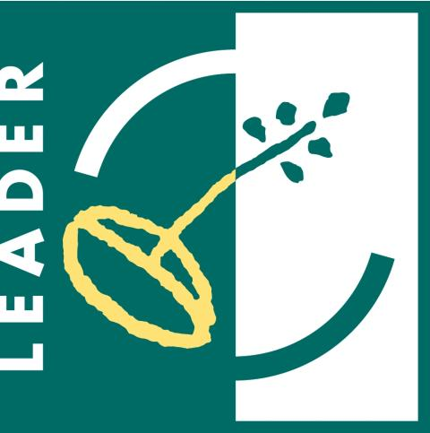
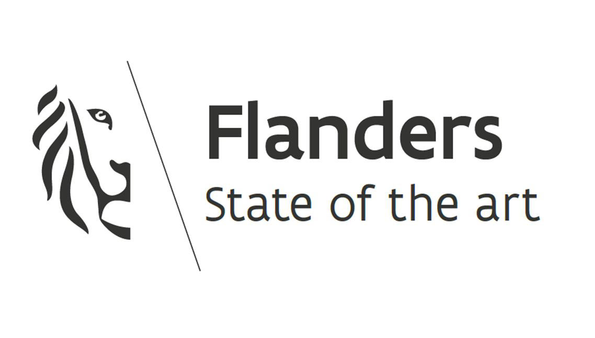
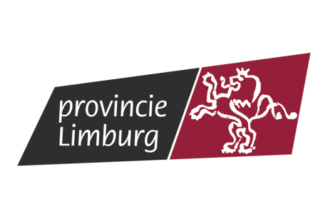

## Ongoing projects 

::: {.d-flex .flex-column .gap-4 .my-4}

<!-- Start of new project -->
::: {.card .shadow-sm .border-0 .bg-primary}
::: {.card-body .p-4}

::: {.d-flex .justify-content-between .align-items-start .mb-2}
<h3 class="card-title text-dark m-0">2017-Present - LTER Camera Trap Wildlife Monitoring Network NPHK</h3>
Long-term Ecological Monitoring
:::

A continuous camera trap monitoring initiative collecting long-term spatial and temporal data on mammal populations in National Park Hoge Kempen. The network operated under a systematic random sampling design from 2017 to 2020 and has since transitioned into a stratified random sampling design. The dataset has already supported multiple published scientific studies, cross-institutional collaborations, and student thesis projects and internships. 

[<i class="fa-solid me-1"></i> Access 2017–2020 Open Dataset on GBIF](https://www.gbif.org/dataset/50cebe49-559b-42e8-955d-1df120b03f89){.btn .btn-frc .btn-lg .mt-3 role="button" target="_blank"}

:::
:::
<!-- End of Project -->

<!-- Start of new project -->
::: {.card .shadow-sm .border-0 .bg-primary}
::: {.card-body .p-4}

::: {.d-flex .justify-content-between .align-items-start .mb-2}
<h3 class="card-title text-dark m-0">2022-Present - Understanding human-wildlife interactions in contrasted protected areas - a novel methodological approach</h3>
PhD Project
:::

This PhD Project of **Wim Kuypers** uses geotagged user-generated data from social media and sports apps, combined with conventional camera traps and targeted surveys, to examine how recreational activities influence the spatiotemporal activity patterns, occupancy, and distribution of mammal species in two Belgian National Parks (and vice versa). The final practical objective is to support well-balanced nature management plans in or close to densely populated zones.

::: {.row .pt-2 .border-top}
::: {.col-md-6}
**Funding:** BOF Doctoral Fund & Fonds spécial de recherche UNamur (Joint PhD)
:::
:::

:::
:::
<!-- End of Project -->

<!-- Start of new project -->
::: {.card .shadow-sm .border-0 .bg-primary}
::: {.card-body .p-4}

::: {.d-flex .justify-content-between .align-items-start .mb-2}
<h3 class="card-title text-dark m-0">2023-Present - Studying wildlife behaviour by combining camera traps and biologgers in a human dominated environment</h3>
PhD Project
:::

The PhD Project of **Siebe Indestege** studies wildlife behaviour in the Hoge Kempen National Park (Belgium) by setting up a biologger network, comparing methodological approaches, and integrating conventional camera trap data. By combining camera trap research and biologgers in state-of-the-art Species Distribution Models, the study aims to improve our in-depth understanding of wildlife behaviour in relation to its surroundings and human activities, enhancing guidelines for conservation and management policies.

::: {.row .pt-2 .border-top}
::: {.col-md-6}
**Funding:** BOF doctoral mandate
:::
:::

:::
:::
<!-- End of Project -->

<!-- Start of new project -->
::: {.card .shadow-sm .border-0 .bg-primary}
::: {.card-body .p-4}

::: {.d-flex .justify-content-between .align-items-start .mb-2}
<h3 class="card-title text-dark m-0">2024-Present - Towards a better integration of multi-species interactions into wildlife management decision-making</h3>
PhD Project
:::

Wildlife management decisions often target a single species, overlooking complex species interactions and conflicting management goals. The PhD project of **Imke Tomsin** focuses on expanding the Generalised Management Strategy Evaluation (GMSE) mechanistic modelling framework to account for multiple interacting species and multi-objective decision-making in complex social-ecological systems. 

::: {.row .pt-2 .border-top}
::: {.col-md-6}
**Funding:** FWO PhD Fellowship Fundamental Research (Grant number 1120326N)
:::
:::

:::
:::
<!-- End of Project -->

<!-- Start of new project -->
::: {.card .shadow-sm .border-0 .bg-primary}
::: {.card-body .p-4}

::: {.d-flex .justify-content-between .align-items-start .mb-2}
<h3 class="card-title text-dark m-0">2025-Present - Smart Long-Term Ecological Monitoring Network</h3>
Long-term Ecological Monitoring
:::

This project aims to establish an automatic, cost-effective, energy-efficient, near real-time data collecting monitoring system in the National Park Hoge Kempen (NPHK). By integrating biotic and abiotic parameters via LoRaWAN technology, it will enable the detection of environmental changes, inform adaptive management, support policy development, and set a precedent for national and landscape park monitoring in Belgium.

::: {.row .pt-2 .border-top}
::: {.col-md-6}
**Funding:** BOF Scientific Equipment Program - Flemish Government
:::
:::

:::
:::
<!-- End of Project -->

<!-- Start of new project -->
::: {.card .shadow-sm .border-0 .bg-primary}
::: {.card-body .p-4}

::: {.d-flex .justify-content-between .align-items-start .mb-2}
<h3 class="card-title text-dark m-0">2025-Present - Human-wolf interactions in Belgium: unravelling local dynamics and stakeholder perspectives</h3>
PhD Project
:::

The resurgence of wolves (*Canis lupus*) in Belgium marks both a significant achievement for European wildlife conservation and a complex challenge for human–wildlife coexistence in a densely populated, agriculturally intensive landscape. The PhD project of **Eliana Muccio** investigates pathways to sustainable coexistence between humans and wolves by addressing ecological, socio-economic, and political dimensions and reconciling the divergent interests of farmers, conservationists, policymakers, hunters, and local communities.

::: {.row .pt-2 .border-top}
::: {.col-md-6}
**Funding:** BOF Doctoral Fund & Fonds spécial de recherche UNamur (Joint PhD)
:::
:::

:::
:::
<!-- End of Project -->

<!-- Start of new project -->
::: {.card .shadow-sm .border-0 .bg-primary}
::: {.card-body .p-4}

::: {.d-flex .justify-content-between .align-items-start .mb-2}
<h3 class="card-title text-dark m-0">2025-Present - EMPOWER2LIV@UTN: Empowering Marginalized Urban and Rural Communities (MUR) in Imbabura to Enhance Well-Being and Quality of Life Through the Kawsay Living Lab Hosted by Universidad Técnica del Norte (UTN)</h3>
Research Collaboration Project
:::

The project aims to improve well-being and quality of life for vulnerable Indigenous communities in both urban and rural areas of Imbabura through inclusive, community-driven initiatives. Central to this approach is the revitalization of Ancestral Knowledge ('Saberes Ancestrales'), validating traditional wisdom through scientific research and creating fusions with contemporary practices across education, health, environment, economy, and nutrition. The Kawsay Living Lab serves as a participatory platform where community members, researchers, and students co-create locally tailored solutions grounded in both traditional knowledge and scientific expertise.

::: {.row .pt-2 .border-top}
::: {.col-md-6}
**Funding:** VLIR-UOS
:::
:::

:::
:::
<!-- End of Project -->

<!-- Start of new project -->
::: {.card .shadow-sm .border-0 .bg-primary}
::: {.card-body .p-4}

::: {.d-flex .justify-content-between .align-items-start .mb-2}
<h3 class="card-title text-dark m-0">2026-Present - Addressing bird damage in fruit cultivation through an innovative, data-driven approach</h3>
Research Project
:::

The project addresses bird damage in fruit cultivation with an innovative, data-driven approach. Through passive acoustic monitoring (PAM), we map which bird species cause damage, where, and when. We use these insights to develop a spatially explicit model that predicts the risk of damage in the Haspengouw Southwest region and enables targeted action. In addition, we test smart deterrent methods that are only activated when species causing actual damage are present, in order to prevent habituation and increase efficiency.

::: {.row .pt-2 .border-top}
::: {.col-md-6}
**Funding:** Department of Environment - Flemish Government
:::
:::

:::
:::
<!-- End of Project -->

<!-- Start of new project -->
::: {.card .shadow-sm .border-0 .bg-primary}
::: {.card-body .p-4}

::: {.d-flex .justify-content-between .align-items-start .mb-2}
<h3 class="card-title text-dark m-0">2026-Present - FireRisk: Integrated Wildfire Risk Assessment and Response in the region of Flanders</h3>
Research Project
:::

The FireRisk project combines high-resolution spatial datasets, advanced modelling, AI-driven visualisation tools, and crisis management strategies to develop a formal wildfire risk assessment system. It aims to generate spatially explicit indicators for wildfire danger, develop locally calibrated fire spread models, improve emergency responder training using 3D visualisation, and translate scientific insights into actionable frameworks for both operational decision-making and long-term land management.

[<i class="fa-solid fa-database me-1"></i> Read More ](https://www.researchportal.be/en/project/firerisk-integrated-wildfire-risk-assessment-and-response-region-flanders){.btn .btn-frc .btn-lg .mt-3 role="button" target="_blank"}

::: {.row .pt-2 .border-top}
::: {.col-md-6}
**Funding:** FWO Strategic Basic Research (SBO) 
:::
:::

:::
:::
<!-- End of Project -->

<!-- Start of new project -->
::: {.card .shadow-sm .border-0 .bg-primary}
::: {.card-body .p-4}

::: {.d-flex .justify-content-between .align-items-start .mb-2}
<h3 class="card-title text-dark m-0">2026-Present - LEADER project bird damage in fruit cultivation: innovative monitoring and sustainable management strategies</h3>
Research Project
:::

In collaboration with INBO and pcfruit, this project develops targeted strategies to measure and mitigate bird damage in fruit cultivation. By combining passive acoustic monitoring (PAM) and machine learning with visual counts, GIS, and remote sensing, predictive risk models will be developed. Additionally, the project tests smart deterrence technologies that activate exclusively when target species are present.

::: {.row .pt-2 .border-top}
::: {.col-md-6}
**Funding:** LEADER (Co-funded by the European Union, the Flemish Government, and the Province Limburg) (HZW26/LEA-RP/008)
:::
::: {.col-md-6 .d-flex .justify-content-end .align-items-center .gap-3}

:::
:::

:::
:::
<!-- End of Project -->

:::

## Past projects

::: {.d-flex .flex-column .gap-4 .my-4}

<!-- Start of new project -->
::: {.card .shadow-sm .border-0 .bg-primary}
::: {.card-body .p-4}

::: {.d-flex .justify-content-between .align-items-start .mb-2}
<h3 class="card-title text-dark m-0">2025-2026 - Francqui Chair: Prof. Dr Hans Van Dyck</h3>
Franqui Chair (Host/Promoter)
:::

Prof. Dr. Hans Van Dyck (UCLouvain) was awarded the prestigious Francqui Chair at Hasselt University. His work focuses on behavioural landscape ecology, examining evolutionary and ecological responses in human-dominated landscapes using insects and birds. The chair's programme explored topics across behavioural ecology, functional morphology, thermal ecology, One Health, nature conservation, and the intersection between science, society, and philosophy.

::: {.row .pt-2 .border-top}
::: {.col-md-6}
**Funding:** Francqui Foundation (Federal) 
:::
:::

:::
:::
<!-- End of Project -->

<!-- Start of new project -->
::: {.card .shadow-sm .border-0 .bg-primary}
::: {.card-body .p-4}

::: {.d-flex .justify-content-between .align-items-start .mb-2}
<h3 class="card-title text-dark m-0">2021-2023 - Assessment of the macroinvertebrate biodiversity on green roofs</h3>
PhD Project
:::

The PhD research of **Jeffrey Jacobs** focused on providing an overview of the total biodiversity of green roofs in Flanders by describing in detail the aboveground and belowground macroinvertebrate communities and their functional roles. Furthermore, the project assessed the potential value of urban green roofs for native pollinator conservation in Flanders by comparing them to ground-level reference inventories and sites.

::: {.row .pt-2 .border-top}
::: {.col-md-6}
**Funding:** BOF doctoral mandate
:::
:::

:::
:::
<!-- End of Project -->

<!-- Start of new project -->
::: {.card .shadow-sm .border-0 .bg-primary}
::: {.card-body .p-4}

::: {.d-flex .justify-content-between .align-items-start .mb-2}
<h3 class="card-title text-dark m-0">2019-2023 - A Statistical Framework for Camera Trap Data Analysis in Ecological Research</h3>
PhD Project
:::

The PhD project of **Martijn Bollen** focused on developing a statistical framework to analyse camera trap data and study mammalian population dynamics in the National Park Hoge Kempen (Belgium). By extending existing methodology into less assumption-driven models for single species and communities, the research compared their statistical, practical, and economic performance to produce improved guidelines for data collection and conservation policies.

::: {.row .pt-2 .border-top}
::: {.col-md-6}
**Funding:** BOF doctoral mandate
:::
:::

:::
:::
<!-- End of Project -->

<!-- Start of new project -->
::: {.card .shadow-sm .border-0 .bg-primary}
::: {.card-body .p-4}

::: {.d-flex .justify-content-between .align-items-start .mb-2}
<h3 class="card-title text-dark m-0">2019-2023 - Assessing the effects of global change on avian migratory pathways: the case of the European Nightjar</h3>
PhD Project
:::

The PhD project of **Michiel Lathouwers** studied the migration ecology of the European Nightjar (*Caprimulgus europaeus*), a crepuscular bird species that migrates between Europe and Central Africa. The research assessed key European and African stopover zones as well as wintering sites, providing insights into how environmental changes impact migratory pathways and population dynamics.

::: {.row .pt-2 .border-top}
::: {.col-md-6}
**Funding:** BOF doctoral mandate
:::
:::

:::
:::
<!-- End of Project -->

<!-- Start of new project -->
::: {.card .shadow-sm .border-0 .bg-primary}
::: {.card-body .p-4}

::: {.d-flex .justify-content-between .align-items-start .mb-2}
<h3 class="card-title text-dark m-0">2018-2022 - Effectiveness of management agreements for field and meadow birds (breeding ground, food and breeding success)</h3>
Research Project
:::

To evaluate agri-environment schemes (AES) aimed at counteracting farmland bird declines, this study investigated how unharvested set-aside fields with winter bird crops (WBC) and nearby landscape elements influence wintering farmland bird communities in Dry Hesbaye (Flanders, Belgium). 

[<i class="fa-solid fa-database me-1"></i> Read More ](https://doi.org/10.1016/j.gecco.2023.e02533){.btn .btn-frc .btn-lg .mt-3 role="button" target="_blank"}

::: {.row .pt-2 .border-top}
::: {.col-md-6}
**Funding:** Department of Environment - Flemish Government 
:::
:::

:::
:::
<!-- End of Project -->

<!-- Start of new project -->
::: {.card .shadow-sm .border-0 .bg-primary}
::: {.card-body .p-4}

::: {.d-flex .justify-content-between .align-items-start .mb-2}
<h3 class="card-title text-dark m-0">2017-2018 - AnaEE: Infrastructure for Analysis and Experimentation on Ecosystems</h3>
Research Project
:::

Supported by the Flemish Government, this project formed part of the European research infrastructure program (ESFRI) on Analysis and Experimentation on Ecosystems (AnaEE). The AnaEE infrastructural platforms, including the Ecotron Hasselt University, were designed for experimental manipulation of managed and unmanaged ecosystems, supporting scientists in performing analyses, assessments, and forecasts on the impacts of climate change and other major disturbances.

::: {.row .pt-2 .border-top}
::: {.col-md-6}
**Funding:** Flemish Universities - Flemish Government 
:::
:::

:::
:::
<!-- End of Project -->

<!-- Start of new project -->
::: {.card .shadow-sm .border-0 .bg-primary}
::: {.card-body .p-4}

::: {.d-flex .justify-content-between .align-items-start .mb-2}
<h3 class="card-title text-dark m-0">2013-2018 - Environmentally Controlled Facility (ECOTRONS)</h3>
Reserach Infrastructure Project
:::

This Ecotron+ infrastructure is a complex of 12 sophisticated semi-automatically environmentally controlled chambers. The state-of-the-art facility allows the controlled study of "global change" and builds a bridge between the complexity of "in situ" experiments and lab/greenhouse experiments in relation to the environment (global e.g. climate change; local e.g. pollution). The infrastructure facilitates to study the dynamics of ecological processes and functions in order to understand the mechanisms of responses and interactions of the different species in an ecosystem (to stress factors). A variety of environmental conditions - temperature, humidity, CO2 concentration, pollution, ozone, ... - can be perfectly replicated x-times. The Ecotron+ is the result a collaboration between the Centre of Environmental Sciences (CMK-UHasselt) and the Research Group of Plant and Vegetation Ecology (PLECO- University of Antwerp) and the Regional Landscape Kempen and Maasland (RLKM), and the Agency for Nature and forestry (ANB).

::: {.row .pt-2 .border-top}
::: {.col-md-6}
**Funding:** Hercules Foundation - Reserach Foundation Flanders (FWO)
:::
:::

:::
:::
<!-- End of Project -->

<!-- Start of new project -->
::: {.card .shadow-sm .border-0 .bg-primary}
::: {.card-body .p-4}

::: {.d-flex .justify-content-between .align-items-start .mb-2}
<h3 class="card-title text-dark m-0">2012-2024 - Valorisation of Environmental Scientific Services for Climate Stress Mitigation in Eastern Cuba</h3>
Research Collaboration Project
:::

Within the VLIR-UOS Cuba-IUC programme with Universidad de Oriente, this project focused on the valorisation of environmental scientific services to mitigate climate stress in eastern Cuba. The research aimed to assess and strengthen ecological resilience, supporting sustainable management strategies and environmental protection in vulnerable coastal and terrestrial ecosystems.

::: {.row .pt-2 .border-top}
::: {.col-md-6}
**Funding:** VLIR-UOS (Cuba-IUC Programme)
:::
:::

:::
:::
<!-- End of Project -->

::: 